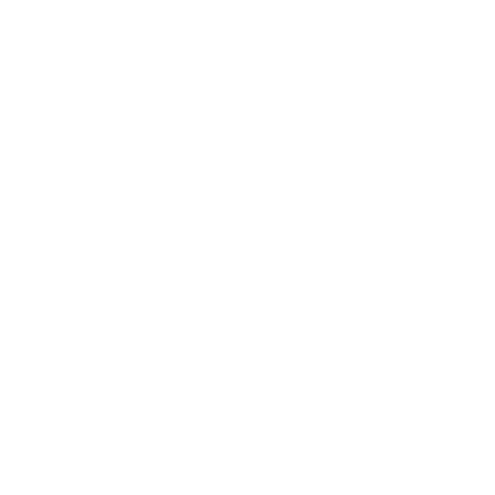
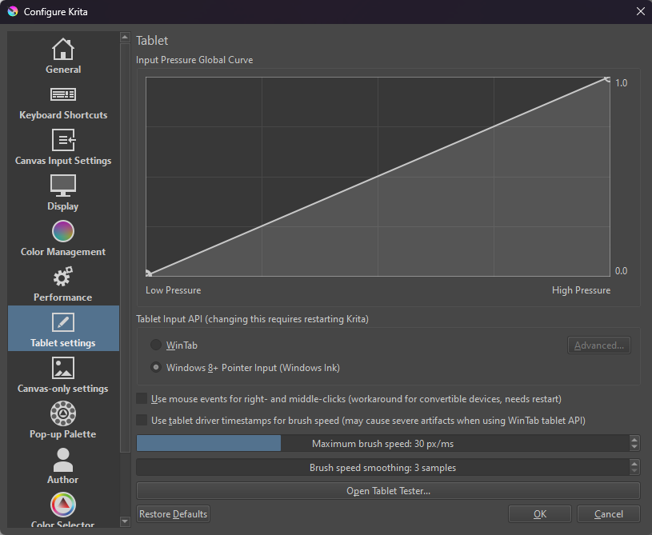
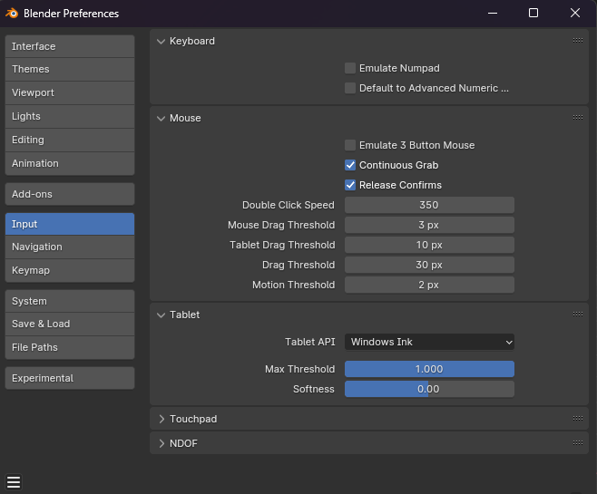

# PenCast: Remote Pen & Touch Emulator for Windows

 

PenCast is a remote pen and touch input emulator designed for Windows environments. It seamlessly integrates input from mobile devices, enabling users to control and interact with Windows applications as if they were using a physical pen or touch interface directly on their computer.

## Features

* **Remote Pen & Touch Control:** Control your Windows applications with precision pen and touch inputs from mobile devices.
* **Windows API Integration:** Utilizes the `InjectSyntheticPointerInput` and `SendInput` functions from `winuser.h` for accurate and responsive input emulation.
* **Mirror Networking Integration:** Employs the [Mirror Networking library](https://github.com/MirrorNetworking/Mirror) for Unity to establish a reliable and efficient connection between client devices and the Windows host.
* **Tested with Industry-Standard Applications:** PenCast has been successfully tested with popular creative software like Photoshop, Krita, and Blender.

## How it Works

PenCast utilizes a client-server architecture. The mobile device acts as a client, sending input data to the Windows host (server) which then translates these inputs into synthetic pen and touch events using the Windows APIs. This allows users to control their desktop applications as if they were using a physical pen or touchscreen.

## Tested Applications & Configurations

While Photoshop generally works seamlessly with PenCast when pen pressure is enabled, some applications may require specific settings for optimal functionality:

**Krita:**

* Open "Settings -> Configure Krita -> Tablet Settings".
* Set "Tablet Input API" to "Windows Ink".

**Blender:**

* Open "Edit -> Preferences -> Input".
* Set "Tablet API" to "Windows Ink".

## Installation

* **Download the Latest Build:** From [GitHub Releases](https://github.com/FUZASHI/pencast/releases).
* **Install Unity Project:** Clone or download this repository and open it in Unity.

## Technology Stack

* **[Unity](https://unity.com/):** Game Engine
* **[Mirror Networking](https://github.com/MirrorNetworking/Mirror):** Networking Library
* **[Winuser.h](https://learn.microsoft.com/en-us/windows/win32/api/winuser/):** Windows API for input emulation

## License

**This project is licensed under the MIT License - see the [LICENSE.md](LICENSE.md) file for details.**

## Contact

**For any inquiries or feedback, feel free to open an issue or contact me at [muutax@hotmail.com](mailto:muutax@hotmail.com).**